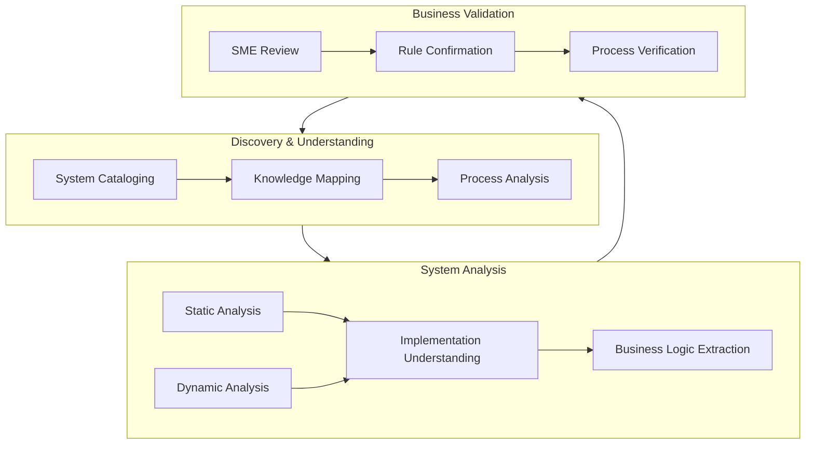
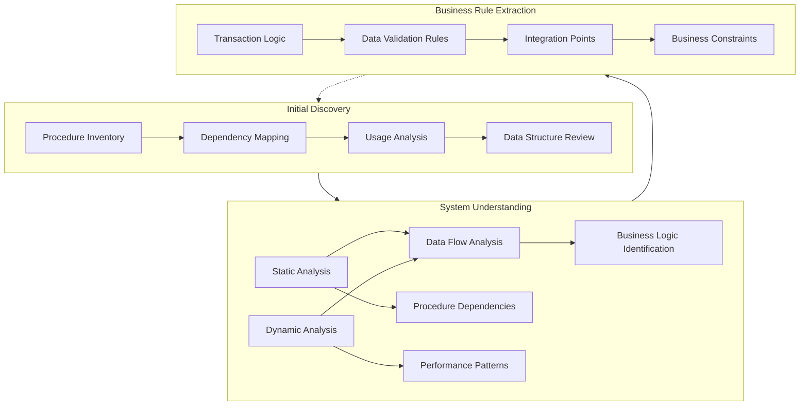
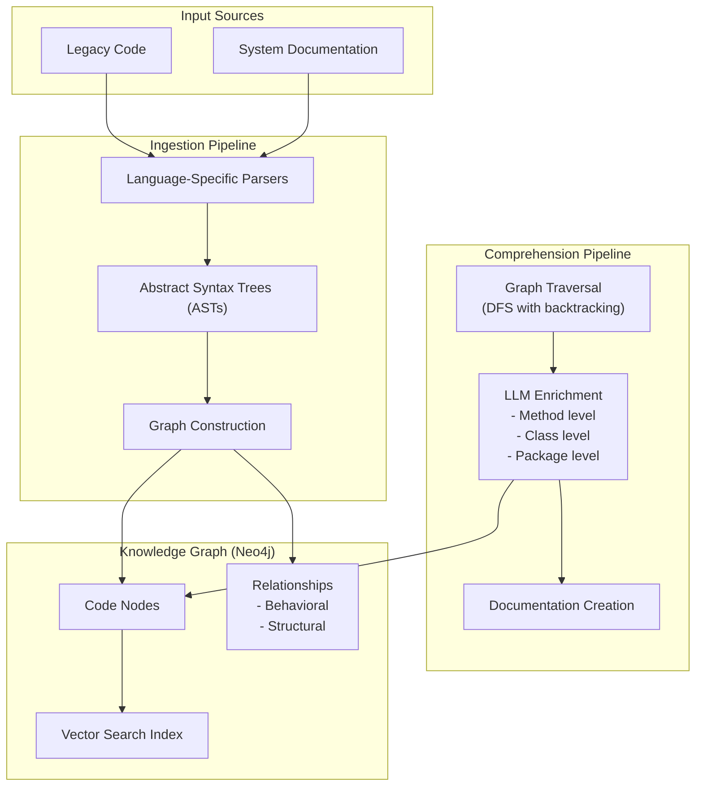
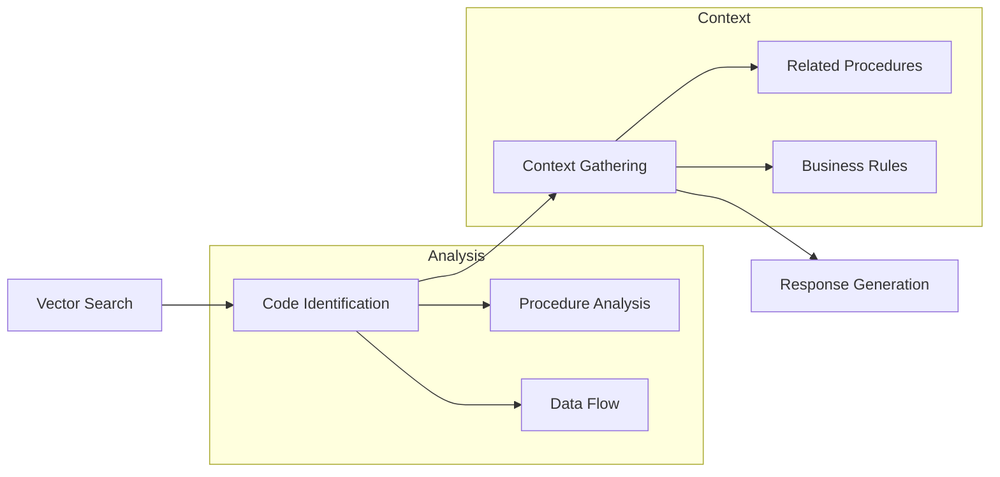

# Understanding Legacy System Modernization: Challenges and Approaches

*Note: This analysis draws from "Legacy Modernization meets GenAI" (Ferri et al., 2024), synthesizing insights to understand approaches to legacy system modernization, particularly in the context of stored procedures modernization.*

Legacy system modernization fundamentally challenges organizations to understand not just code, but years of accumulated business knowledge embedded within systems. As Ferri et al. (2024) observe, these systems become "large and complex, with multiple layers and patches built over time, making behavior difficult to change." Organizations often hesitate to modernize due to prohibitive costs, lengthy time investments, and unclear value propositions.

## The Modernization Process and Its Challenges

The modernization journey consists of overlapping phases that inform and influence each other, each presenting distinct challenges that need addressing:

Initial discovery focuses on understanding the landscape through system cataloging, technology inventory, and process mapping. This phase often reveals the first major challenge: knowledge distribution. Subject Matter Experts (SMEs) hold crucial system knowledge, but as Ferri et al. (2024) note, "Their business and technical expertise, developed over many years, makes them a scarce resource within organizations."

Building on discovery, system understanding employs both static and dynamic analysis. Static analysis produces dependency diagrams and program flows, while dynamic analysis reveals actual usage patterns. Together, they help decode not just what the code does, but why it does it that way. The challenge here lies in comprehending both implementation details and overall system design, including dependencies and integration points that reflect years of business decisions.

Business rule extraction runs continuously throughout the process, using model-based frameworks to capture business logic while relying on SME validation for accuracy. This phase particularly challenges organizations as it requires bridging technical implementations with business requirements.

These phases interact dynamically, as shown below:



The relationship between phases and their practical implementation can be understood through this framework:

| Phase | Key Activities & Outputs | Primary Challenges | 
|-------|-------------------------|-------------------|
| Discovery | - System and process mapping<br>- Technology inventory<br>- Knowledge distribution understanding | - Scattered documentation<br>- Limited SME availability<br>- Unclear system boundaries |
| System Analysis | - Dependency mapping<br>- Runtime behavior analysis<br>- Integration point identification | - Complex legacy code<br>- Incomplete runtime data<br>- Technical-business gap |
| Business Rules | - Rule documentation<br>- Process constraints<br>- Data flow mapping | - Embedded logic<br>- Undocumented assumptions<br>- Legacy constraints |

This structured approach helps organizations avoid "Big Bang" cutover risks while making meaningful progress. Success metrics from Ferri et al. (2024) demonstrate tangible improvements - for instance, reverse engineering time for a 10,000-line codebase reduced from 6 weeks to 2 weeks using systematic approaches.

The value of this framework lies in its ability to:
- Break down modernization into manageable, value-generating increments
- Establish clear safety nets through systematic analysis
- Enable continuous validation through business stakeholder feedback
- Create a foundation for understanding complex legacy systems

This understanding forms the basis for approaching specific modernization challenges, such as stored procedures transformation or adoption of new technologies like GenAI in the modernization process.

# Understanding Stored Procedures Modernization

Modernizing a system containing 20,000 stored procedures across databases presents a unique challenge within the legacy modernization landscape. While the core modernization principles remain applicable, the distributed nature of stored procedures across database systems adds layers of complexity to the understanding and transformation process.

## Complexity in Database Systems

The challenge of modernizing stored procedures mirrors the broader legacy system challenges outlined by Ferri et al. (2024), but with database-specific considerations. These procedures often represent years of accumulated business logic, data transformations, and system integrations spread across multiple databases. The complexity grows not just from the number of procedures, but from their interconnected nature - procedures calling other procedures, sharing common data structures, and implementing overlapping business rules.

Knowledge about these procedures exists in multiple dimensions. The static code reveals the implementation details, but understanding why certain approaches were chosen often requires deep system knowledge. Runtime behavior shows how procedures actually operate in production, while SME knowledge provides crucial context about business rules and historical decisions that shaped the current implementation.

# Applying the Modernization Framework to Stored Procedures

The modernization process adapts our established framework to the unique characteristics of stored procedures. Similar to general legacy systems, procedures accumulate years of business logic and data transformations, but their distributed nature across database systems adds specific complexity to each framework phase.

## Framework Application to Database Systems

During initial discovery, teams must understand not just individual procedures, but their intricate web of relationships. A stored procedure rarely exists in isolation - it may call other procedures, share common data structures, and implement overlapping business rules. As Ferri et al. (2024) note, this interconnected nature makes understanding the full scope crucial before any modernization attempts.

The process adapts each framework phase to database-specific needs:



Each phase addresses specific stored procedure challenges:

| Framework Phase | Stored Procedure Focus | Specific Challenges | Approach |
|----------------|------------------------|-------------------|-----------|
| Initial Discovery | - Procedure inventory across databases<br>- Call hierarchies<br>- Data dependencies | - Distributed procedures<br>- Complex dependencies<br>- Hidden relationships | - Systematic cataloging<br>- Cross-database mapping<br>- Access pattern analysis |
| System Understanding | - Data flow patterns<br>- Transaction boundaries<br>- Performance characteristics | - Complex SQL logic<br>- Runtime dependencies<br>- Performance implications | - Static SQL analysis<br>- Dynamic execution monitoring<br>- Impact analysis |
| Business Rule Extraction | - Data validation rules<br>- Transaction logic<br>- Business constraints | - Embedded business logic<br>- Data integrity rules<br>- Cross-procedure rules | - SQL pattern analysis<br>- Transaction flow mapping<br>- Constraint documentation |

This adapted framework helps teams:
1. Systematically map procedure relationships and dependencies
2. Understand both static structure and runtime behavior
3. Extract business rules embedded in SQL logic
4. Plan modernization while maintaining data integrity

The framework's value becomes particularly evident when dealing with stored procedures because it:
- Addresses both technical and business aspects of database operations
- Maintains focus on data integrity and system reliability
- Provides clear progression from understanding to transformation
- Enables incremental modernization of interdependent procedures

# Understanding Where and Why GenAI Aids Modernization

## The Value Proposition and Limitations

While most attention focuses on code generation, Ferri et al. (2024) identify GenAI's fundamental value in understanding existing code. This insight proves particularly significant because "developers spend a lot more time reading code than writing it." For modernization efforts, this shifts the focus from generating new code to comprehending existing systems.

GenAI's contribution manifests in two critical areas:

1. Code Comprehension and Knowledge Extraction
   The article demonstrates concrete improvement: reverse engineering time for 10,000 lines of code reduced from 6 weeks to 2 weeks. This efficiency gain stems from GenAI's ability to:
   - Parse and explain code segments at multiple levels
   - Generate abstracted program flowcharts
   - Produce documentation bridging technical and business understanding

2. SME Dependency Reduction
   Organizations often find their SMEs "stretched too thin across multiple teams just to keep the lights on." GenAI addresses this through knowledge graph-enhanced chatbots that can provide SME-like responses, enabling business analysts to understand code without constant SME consultation.

However, GenAI isn't universally beneficial. The article explicitly identifies areas where traditional tools remain superior:

- Dead Code Detection: "We see little or no use in applying GenAI to the problem" because existing static analysis tools like IntelliJ and Sonar better leverage code's structured nature
- Runtime Analysis: APM tools provide more reliable data about system behavior during execution, where GenAI can't improve on direct runtime observation

# CodeConcise: A Technical Deep Dive

## The Foundation: Code as Data
CodeConcise's architecture fundamentally shifts how we analyze code by treating it as structured data rather than text. This approach is crucial because:
- It enables deeper analysis of code structure and relationships
- It allows understanding of embedded business rules
- It facilitates systematic analysis across large codebases

At its core, the system uses Abstract Syntax Trees (ASTs) - a tree representation of code's syntactic structure. This choice is deliberate because it helps analyze code without getting lost in formatting or comments, particularly valuable for understanding stored procedures' logic and data flows.

## System Architecture



## Core Architecture Components

### The Ingestion Pipeline
The first technical challenge in understanding legacy systems is making sense of their structure. The ingestion pipeline addresses this through:

1. Abstract Syntax Trees (ASTs)
   - Converts human-readable code into structured format
   - Extracts "intrinsic structure" and relationships
   - Enables systematic analysis of code patterns

2. Graph Database Storage (Neo4j)
   The system stores ASTs in a graph database, establishing granular relationships between code elements. This approach:
   - Reduces noise by focusing on relevant code segments
   - Enables efficient use of LLM context windows
   - Captures relationships like "code in this node transfers control to code in that node"

### The Comprehension Pipeline
Building on the structured representation, this pipeline adds layers of understanding through:

1. Graph Traversal
   - Uses "Depth-first Search with backtracking in post-order traversal"
   - Analyzes code at various depths
   - Ensures comprehensive codebase coverage
   - Enables systematic relationship discovery

2. LLM-Generated Explanations
   The pipeline enriches the graph at multiple levels:
   - Method level explanations for specific implementations
   - Class level understanding for component interaction
   - Package level insights for architectural understanding

3. Knowledge Graph Integration
   The final component leverages Neo4j's capabilities:
   - Vector search enables RAG integration
   - Behavioral edges show how code interacts
   - Structural edges reveal code organization
   - Contextual navigation across both dimensions

When processing code, the components work together in sequence:
1. The ingestion pipeline first converts code into ASTs and builds the graph
2. The comprehension pipeline then traverses and enriches this graph
3. The knowledge graph enables querying this enriched understanding

# CodeConcise in Practice: From Authorization to Stored Procedures

## Understanding the Authorization Example
The article demonstrates CodeConcise's capabilities through an authorization system example, showing how each component works in practice:

When a business analyst asks "how does authorization work when viewing card details?", the system:
1. Uses vector search in Neo4j to find relevant code nodes
2. Traverses the knowledge graph through both:
   - Behavioral edges (showing how code interacts)
   - Structural edges (showing code organization)
3. Provides comprehensive context including:
   - The authorization code itself
   - Related methods
   - Package context
   - Data structures

The above example shows how the components enable contextual understanding of complex code.

## Application to Stored Procedures

The success of CodeConcise with authorization systems provides a blueprint for stored procedure modernization. Consider this stored procedure example:

```sql
CREATE PROCEDURE GetCustomerOrders
AS
BEGIN
    SELECT * FROM Orders
    WHERE CustomerID = @CustomerID
    AND OrderStatus = 'Active'
END
```

The system processes stored procedures by:
1. AST Processing
   - Parses SQL into structured AST representation
   - Identifies data relationships (Orders, CustomerID)
   - Maps business rules (OrderStatus = 'Active')
   - Understands procedure logic and data flows

2. Knowledge Graph Integration
   - Connects procedure calls (procedure A calls procedure B)
   - Maps data dependencies (tables, parameters)
   - Links to business documentation
   - Captures business process relationships

3. Query Understanding
   When asked "How does order processing work?", the system:
   - Identifies relevant stored procedures
   - Maps procedure call chains
   - Shows data flow between procedures
   - Explains business logic in context



## Implementation Results and Benefits

The article's case study with COBOL/IDMS systems demonstrates significant benefits that can extend to stored procedure modernization:

1. Efficiency Improvements
   - Reduced analysis time from 6 weeks to 2 weeks for 10,000 lines
   - Potential saving of 240 FTE years for large programs
   - Enhanced business analyst autonomy
   - Reduced SME dependencies

2. Quality Enhancements
   - Improved documentation accuracy
   - Better understanding of complex queries
   - Bridged technical-business communication gap
   - Consistent, context-aware responses

These results suggest similar efficiency gains could be achieved when modernizing 20,000 stored procedures, particularly in:
1. More efficient analysis of database code
2. Better understanding of procedure relationships
3. Clearer mapping of data dependencies
4. Improved modernization planning

## Implementation Considerations

The article notes important adaptations needed for real client code:
1. Supporting different technology stacks
2. Handling client-specific terminology
3. Adapting to various code organization patterns

For stored procedures, similar adaptations would be needed for:
- Different SQL dialects
- Various database architectures
- Complex procedure dependencies

This analysis combines the article's proven framework with technical extensions for stored procedure modernization, maintaining the core benefits while addressing database-specific challenges.