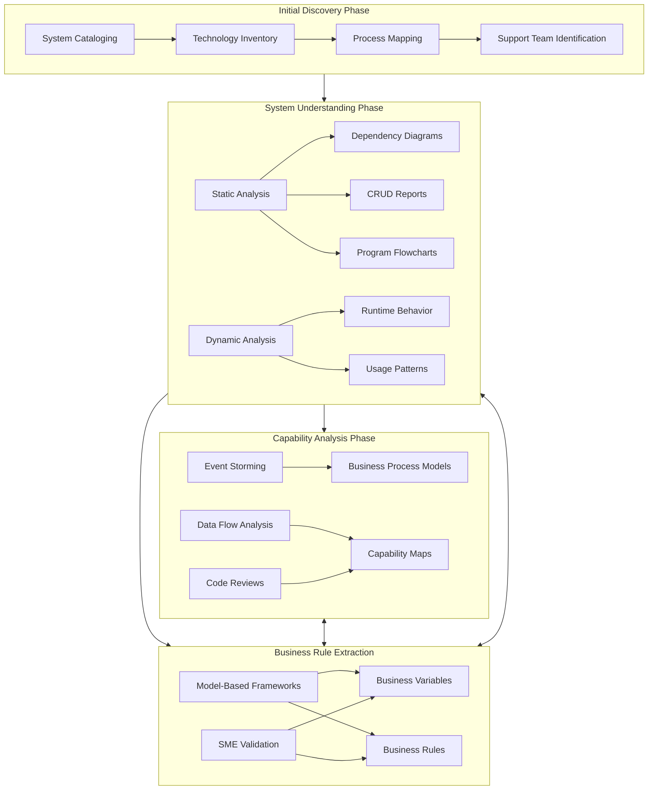
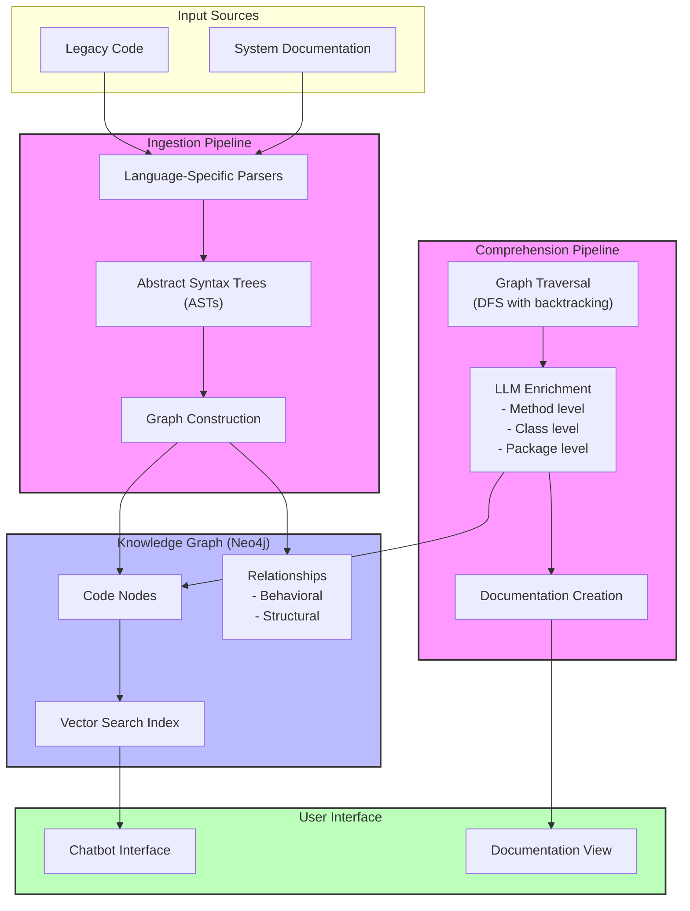

# Understanding Legacy System Modernization: Challenges and Approaches

*Note: This is based on the article "Legacy Modernization meets GenAI" at martinfowler.com and is duly cited and needs be updated*

## Phase Structure and Relationships in Modernization

The modernization process consists of several overlapping phases that inform and influence each other. While these phases might appear sequential, they often run in parallel and provide feedback to each other, creating a dynamic modernization environment.

### Initial Discovery Phase
This foundation phase focuses on understanding the landscape:
- System cataloging establishes the baseline
- Technology inventory identifies current stack and dependencies
- Process mapping outlines business operations
- Support team identification helps understand knowledge distribution

### System Understanding Phase
Building on initial discovery, this phase employs dual analysis approaches:
- Static analysis produces artifacts like dependency diagrams, CRUD reports, and flowcharts
- Dynamic analysis reveals actual usage patterns and runtime behavior
- Both approaches work together to build a complete picture

### Capability Analysis Phase
This phase overlaps significantly with system understanding:
- Event storming sessions capture business processes
- Data flow analysis maps information movement
- Code reviews dive into complex subsystems
- All activities contribute to building capability maps

### Business Rule Extraction
This ongoing phase interacts with all others:
- Model-based frameworks extract business variables and rules
- SME validation ensures accuracy
- Feeds back into system understanding and capability analysis

These phases don't operate in isolation. For example, findings from capability analysis might trigger new areas for system understanding, while business rule extraction might reveal the need for additional discovery work. This interconnected nature ensures comprehensive modernization coverage while allowing for iterative improvements.

## Implementation Phases and Dependencies

| Phase | Primary Activities | Key Outputs | Dependencies | Typical Challenges |
|-------|-------------------|-------------|--------------|-------------------|
| 1. Initial Discovery | - System cataloging - Technology inventory - Process mapping - Support team identification | - Modernization scope definition - Initial technology landscape - Stakeholder map | None | - Incomplete documentation - Scattered knowledge - Unclear system boundaries |
| 2. System Understanding | - Static code analysis - Dynamic runtime analysis - Documentation review - SME interviews | - Dependency diagrams - CRUD reports - Program flowcharts - Runtime behavior maps | Initial Discovery | - Limited SME availability - Complex legacy codebases - Incomplete runtime data |
| 3. Business Rule Extraction | - Model-based framework analysis - Business variable identification - Rule documentation - SME validation | - Business rules catalog - Variable relationships - Process constraints | System Understanding | - Embedded business logic - Undocumented rules - Legacy framework limitations |
| 4. Capability Analysis | - Event storming - Process mapping - Data flow analysis - Code reviews | - Capability maps - Business process models - Integration points | System Understanding, Business Rule Extraction | - Complex dependencies - Overlapping capabilities - Legacy integration patterns |
| 5. Implementation Planning | - Modernization approach selection - Risk assessment - Resource planning - Timeline development | - Modernization roadmap - Risk mitigation plan - Resource allocation | All previous phases | - Balancing risks vs. benefits - Resource constraints - Business continuity requirements |

### Phase Relationships and Timing

While these phases appear sequential, they often overlap and inform each other. For example:
- Business rule extraction might start during system understanding once core components are identified
- Capability analysis can begin in parallel with business rule extraction
- Implementation planning might start early but evolves as understanding deepens

The time investment in each phase varies based on system complexity, documentation quality, and SME availability. For instance, as noted in the article, reverse engineering 10,000 lines of code typically requires about 6 weeks with traditional approaches.

# The Core Challenges of Modernization

Legacy system modernization is fundamentally a challenge of understanding - understanding not just code, but years of accumulated business knowledge embedded within systems. While modernization approaches have evolved to become safer and more effective, organizations often struggle with making the decision to modernize due to prohibitive costs, time investments, and unclear value propositions.

## The Core Challenges of Modernization

The primary challenge in modernization isn't the technical migration itself - it's understanding what needs to be migrated and why. Legacy systems, particularly long-lived ones, embody critical business operations that have evolved over years. As Ferri et al. (2024) note, these systems become "large and complex, with multiple layers and patches built over time, making behavior difficult to change."

This complexity manifests in several interconnected problems:

### Understanding Implementation Details
Engineers face the challenge of decoding not just what the code does, but why it does it that way. This requires both static analysis of source code and dynamic analysis of runtime behavior. The goal isn't simply to document the current state, but to understand the business logic and constraints embedded within the system.

### System Design Comprehension 
Beyond individual components, understanding how the entire system works together poses another significant challenge. This includes mapping dependencies, data flows, and integration points. The system's design often reflects years of business decisions and compromises that need to be understood before any modernization can begin.

### Knowledge Dependencies
Perhaps most critically, many organizations rely heavily on Subject Matter Experts (SMEs) who hold crucial knowledge about system behavior. As the article points out, "SMEs are consulted at multiple stages during the reverse engineering process... Their business and technical expertise, developed over many years, makes them a scarce resource within organizations." This creates a bottleneck in the modernization process.

## Traditional Approaches to Modernization

Organizations have developed several approaches to tackle these challenges:

### Systematic Code Analysis
Modern modernization efforts begin with comprehensive code analysis using both static and dynamic approaches. Static analysis examines the code structure directly, extracting dependency diagrams, database interactions (CRUD reports), and program flows. Dynamic analysis complements this by observing the system's actual behavior during runtime.

This dual approach helps answer critical questions about system behavior that might not be apparent from documentation or even expert knowledge alone.

### Business Rule Extraction
Understanding business rules embedded in legacy systems requires specialized approaches. For example, model-based frameworks like BREX help extract, visualize, and describe business variables and rules from COBOL systems. This systematic approach helps bridge the gap between technical implementation and business requirements.

### Capability Mapping
Before any modernization work begins, organizations need to "catalog existing technology, processes, and the people who support them" (Ferri et al., 2024). This involves techniques like:

Event Storming: Collaborative sessions that help identify business processes and their relationships
Process Mapping: Documenting how business operations flow through the system
Data Flow Analysis: Understanding how information moves through different system components

This mapping serves two crucial purposes: defining modernization scope and building a roadmap for incremental changes.

## The Value-Driven Approach

The key to successful modernization lies in taking an evolutionary approach that generates value early and incorporates frequent feedback. This means:

1. Breaking down the modernization effort into manageable, value-generating increments
2. Establishing clear safety nets through automated testing
3. Validating changes through continuous feedback from business stakeholders

This approach helps organizations avoid the risks of "Big Bang" cutover while still making meaningful progress toward modernization goals.

## Measuring Success

Modernization success can be measured through concrete metrics. For instance, the article describes how reverse engineering efficiency for a 10,000-line codebase improved from 6 weeks to 2 weeks through systematic approaches. Such metrics help organizations understand the real impact of their modernization efforts.

## Conclusion

Legacy system modernization remains a significant challenge in software engineering. While tools and techniques have evolved to make the process safer and more systematic, organizations still struggle with the fundamental challenges of understanding complex systems and preserving critical business knowledge. Success requires a balanced approach that combines technical analysis with business understanding, all while maintaining a focus on delivering incremental value.

# Understanding Stored Procedures Modernization

Much like the broader legacy system modernization challenges outlined earlier, modernizing a system with 20,000 stored procedures across databases presents a fundamental challenge of understanding - understanding not just the procedures themselves, but the business knowledge and system behaviors they encapsulate.

## Understanding the Problem Space

The core challenges outlined in our modernization framework directly apply to stored procedures:

### Complexity Through Scale
With 20,000 stored procedures distributed across databases and systems, we face similar challenges to traditional legacy systems - "large and complex, with multiple layers and patches built over time" (Ferri et al., 2024). This complexity manifests in:
- Procedures spread across multiple databases
- Potential dependencies between procedures
- Varied business logic implementation patterns
- Historical accumulation of code and logic

### Knowledge Distribution
As with traditional legacy systems, stored procedures often contain critical business operations that have evolved over years. The knowledge about these procedures typically exists in three states:
- The code itself (static implementation)
- Runtime behavior (how they're actually used)
- SME knowledge (why they're implemented certain ways)

## Applying the Modernization Framework

Following our established phases:

### 1. Initial Discovery
In the context of stored procedures:
- Catalog all procedures across databases
- Map which systems call these procedures
- Identify support teams and SMEs
- Document current technology landscape

### 2. System Understanding
Adapting our dual analysis approach:

Static Analysis:
- Procedure dependencies
- Data access patterns (CRUD operations)
- Parameter usage and data flow
- Code complexity metrics

Dynamic Analysis:
- Actual usage patterns
- Performance characteristics
- Real-world data flows
- Integration points with applications

### 3. Business Rule Extraction
For stored procedures specifically:
- Identify business logic embedded in procedures
- Document data validation rules
- Map data transformations
- Understand transaction boundaries

### 4. Capability Analysis
Focusing on stored procedure context:
- Map procedures to business capabilities
- Identify redundant implementations
- Document integration patterns
- Understand data flow between procedures

## Implementation Phases for Stored Procedures

| Phase | Activities | Outputs | Dependencies |
|-------|------------|----------|--------------|
| Discovery | - Procedure inventory - System mapping - Usage analysis | - Complete catalog - System context map | None |
| Understanding | - Code analysis - Performance profiling - Dependency mapping | - Dependency diagrams - Usage patterns | Discovery |
| Business Rules | - Logic extraction - Rule documentation - SME validation | - Business rules catalog - Data flow maps | Understanding |
| Capability Analysis | - Business capability mapping - Integration analysis | - Capability map - Modernization targets | Business Rules |

# Understanding Where and Why GenAI Aids Modernization

## The Core Value Proposition

The article identifies a fundamental insight about GenAI's value in modernization: while most attention focuses on code generation, the real value lies in understanding existing code. This is particularly significant because "developers spend a lot more time reading code than writing it" (Ferri et al., 2024).

## Where GenAI Shows Promise

### Code Comprehension and Knowledge Extraction
The article demonstrates that GenAI excels in two critical areas of understanding:

1. Low-Level Requirements Extraction
The article's concrete example shows that GenAI reduced the time for reverse engineering 10,000 lines of code from 6 weeks to 2 weeks. This improvement comes from GenAI's ability to:
- Parse and explain code segments
- Generate abstracted program flowcharts
- Produce documentation that bridges technical and business understanding

2. High-Level System Understanding
GenAI proves valuable in creating abstractions that help comprehend the overall system, particularly by:
- Creating mental models from code analysis
- Generating explanations at different levels of abstraction
- Connecting technical implementations to business concepts

### SME Dependency Reduction
A significant contribution of GenAI is reducing the bottleneck of SME availability. The article notes that SMEs are "stretched too thin across multiple teams just to keep the lights on." GenAI helps by:
- Providing SME-like responses through knowledge graph-enhanced chatbots
- Enabling business analysts to understand code without constant SME consultation
- Generating documentation that captures SME knowledge

## Where GenAI May Not Add Value

The article explicitly identifies areas where GenAI might not be the best solution:

1. Dead Code Detection
The article states "we see little or no use in applying GenAI to the problem" because:
- Existing static analysis tools are already mature
- Tools like IntelliJ and Sonar are readily available
- These tools better leverage code's structured nature

2. Runtime Analysis
For understanding system behavior during execution:
- APM tools provide more reliable data
- Dynamic analysis through existing tools is more accurate
- GenAI can't improve on direct runtime observation

## The Evolutionary Approach Context

The article emphasizes that GenAI's value must be understood within an evolutionary modernization approach. This approach:
- Reduces modernization risks
- Generates value early
- Incorporates frequent feedback
- Enables gradual system replacement

GenAI enhances this approach by making the understanding phase more efficient, but doesn't replace the need for careful, incremental modernization.

# Understanding CodeConcise: A GenAI Approach to Legacy Modernization

Understanding how GenAI can assist in legacy modernization is crucial for our challenge of modernizing 20,000 stored procedures across databases. The approaches and architecture discussed here provide insights into handling large-scale code comprehension and transformation challenges.

## The Foundation: Code as Data

CodeConcise's approach begins with a fundamental shift in how we view code. Rather than treating code as mere text, it adopts a "Code-as-data" concept, where code is analyzed and processed similar to how we handle structured data. This shift is crucial because it enables deeper analysis of code structure and relationships.

At its core, the system uses Abstract Syntax Trees (ASTs) - a tree representation of code's syntactic structure that helps analyze and understand code without getting lost in formatting or comments. For stored procedures, this approach is particularly relevant as it can help understand the procedure's logic, data flow, and business rules embedded within SQL statements.

## System Architecture

To understand how CodeConcise addresses modernization challenges, let's examine its architecture:

This architecture illustrates how CodeConcise processes legacy code through distinct pipelines to create an enriched knowledge graph. Each component serves specific modernization needs:

1. Input Sources combine both code and documentation, enabling a comprehensive understanding. For example, when analyzing a database query in client code, CodeConcise can incorporate both the technical implementation and business context from documentation.

2. The Ingestion Pipeline transforms raw code into analyzable structures. The article demonstrates this with a concrete example: when analyzing authorization code, the system can identify not just the method calls, but also which conditional branches transfer control to other parts of the system.

3. The Knowledge Graph enables contextual understanding. As the article notes, when answering a query about "how does authorization work when viewing card details?", the system can provide comprehensive context by traversing both behavioral and structural relationships.

## Core Architecture Components

### The Ingestion Pipeline
The first challenge in understanding legacy systems is making sense of their structure. CodeConcise addresses this through its ingestion pipeline:

1. Abstract Syntax Trees (ASTs)
The system parses code into ASTs, converting human-readable code into a structured format. This is crucial because, as the article notes, it allows extraction of "intrinsic structure" and relationships between code entities.

2. Graph Database Storage
These ASTs are stored in a graph database (Neo4j), establishing relationships between code elements. For example, the article describes how "an edge might be saying 'the code in this node transfers control to the code in that node'". This granular relationship mapping serves two key purposes:
    - Reduces noise by focusing on relevant code segments
    - Enables efficient use of LLM context windows

### The Comprehension Pipeline
Building on the structured code representation, the comprehension pipeline adds understanding:

1. Graph Traversal
The system uses algorithms like "Depth-first Search with backtracking in post-order traversal" to analyze code at various depths. This systematic approach ensures comprehensive coverage of the codebase.

2. LLM-Generated Explanations
The pipeline enriches the graph with explanations at different levels:
    - Method level explanations
    - Class level understanding
    - Package level insights

This multi-level approach proved valuable in practice. The article cites an example where they could explain database queries to Business Analysts using business terminology, bridging the technical-business gap.

### Knowledge Graph Integration
The final component brings everything together in an enriched knowledge graph:

1. Vector Search Capabilities
Neo4j's vector search allows integration with RAG (Retrieval-Augmented Generation), enabling context-aware responses to queries.

2. Contextual Navigation
The system can traverse both:
- Behavioral edges (how code interacts)
- Structural edges (how code is organized)

A concrete example from the article demonstrates this: when querying about "authorization for viewing card details," the system can find not just the authorization code, but also related methods, surrounding package context, and relevant data structures.

## Practical Application and Results

The article provides concrete evidence of CodeConcise's effectiveness. In one case study with COBOL/IDMS codebase:
- Traditional approach: 6 weeks to reverse engineer 10,000 lines of code
- With CodeConcise: Reduced to 2 weeks
- Impact: Potential saving of 240 FTE years for the entire modernization program

## Extensibility and Adaptation

A key learning from CodeConcise's development is the importance of extensibility. The article notes that when working with real client code, they needed to adapt the comprehension pipeline to:
- Support different technology stacks
- Accommodate client-specific terminology
- Handle various code organization patterns

This adaptability ensures the tool remains valuable across different modernization contexts.

## Practical Example: Understanding Authorization Logic

The article provides a concrete example of how CodeConcise works in practice. When a Business Analyst needs to understand the authorization system:

1. Initial Query Processing
   - User asks: "How does authorization work when viewing card details?"
   - System uses vector search to find relevant code nodes

2. Context Enhancement
   - Traverses behavioral edges to find related method calls
   - Follows structural edges to understand package organization
   - Incorporates data structure information

3. Knowledge Synthesis
   - Combines technical implementation details with business context
   - Generates explanation using business terminology
   - Provides multi-level understanding (from method to system level)

This example demonstrates how the architecture's components work together to bridge the gap between technical implementation and business understanding, a key challenge identified in legacy modernization.

## Application to Stored Procedures Modernization

The architectural patterns and approaches discussed here provide valuable insights for our stored procedures modernization challenge:

1. The code-as-data approach with ASTs could help parse and understand SQL logic across thousands of procedures
2. A knowledge graph structure could map dependencies between procedures, tables, and business processes
3. LLM enrichment could help translate complex SQL logic into business terminology
4. The combination of static analysis and GenAI could help identify patterns and opportunities for modernization

While our context differs from the mainframe systems discussed in the article, the core challenges remain similar: understanding large volumes of legacy code, extracting business rules, and bridging technical and business understanding. The success of CodeConcise in reducing analysis time (from 6 weeks to 2 weeks for 10,000 lines) suggests similar approaches could help tackle our 20,000 stored procedures modernization effort.

## References

Ferri, A., Coggrave, T., & Sheth, S. (2024). Legacy Modernization meets GenAI.